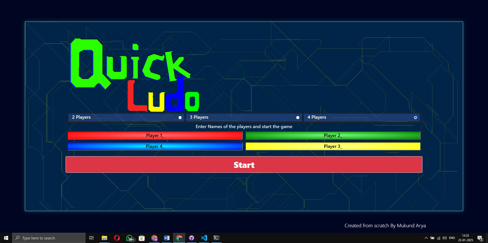
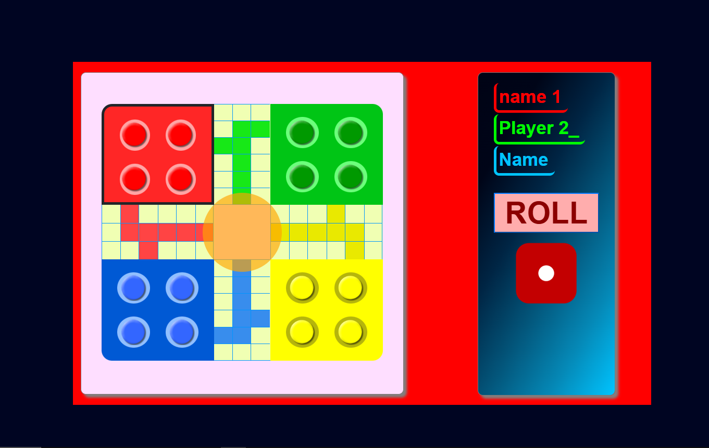

# 🎲 Ludo Game Website  

A modern, fully functional **Ludo Game** built from scratch using **HTML**, **CSS**, and **JavaScript**, enhanced with **Bootstrap** and custom styles. This project offers a classic Ludo game experience with dynamic, modular game logic, making it easy to understand, edit, and extend.

---

## 🏆 Features  

- **Dynamic Game Logic**: Flexible JavaScript logic for smooth gameplay.  
- **Customizable Gameplay**:  
  - Set the number of players (2-4).  
  - Choose unique player colors.  
  - Add player names.  
- **Interactive Ludo Board**: Functional dice rolling and complete in-browser gameplay.  
- **Future-Ready**: Designed with future enhancements in mind, including online multiplayer.  

---

## 📄 Pages  

1. **`index.html`**  
   - Configure the game settings:  
     - Number of players.  
     - Player colors and names.  
   - Lays the foundation for personalized gameplay.  

2. **`game.html`**  
   - The main interface featuring:  
     - A playable Ludo board.  
     - Dice rolling mechanics.  
     - Fully interactive game logic.  

---

## 🛠️ Tech Stack  

- **Frontend:**  
  - HTML5  
  - CSS3  
  - Bootstrap  
- **Game Logic:**  
  - Pure JavaScript  

---

## 🚀 How to Run  

1. **Clone the Repository**:  
   ```bash
   git clone <repository-url>
   ```  

2. **Open the Game**:  
   - Launch `index.html` in your favorite browser to configure game settings.  
   - Proceed to `game.html` to start playing the game.  

---

## 🌟 Future Enhancements  

- **Online Multiplayer Support**  
- **Enhanced Animations** for a more immersive experience.  
- **Improved UI/UX** with advanced frameworks or libraries.  

---

## 📷 Screenshots  

### 1. **Game Setup Page (`index.html`)**  
_Set up the number of players, colors, and player names._  

  

### 2. **Gameplay Page (`game.html`)**  
_Play the Ludo game with a functional board and dice rolling._  


---

## 🤝 Contributing  

Contributions are welcome! Feel free to fork this repository, create a new branch, and submit a pull request.  

---

## 📜 License  

This project is licensed under the **MIT License**. See the [LICENSE](LICENSE) file for more details.  

---

## 🙌 Acknowledgments  

Inspired by the classic board game Ludo and built to provide a fun and customizable gaming experience.  

